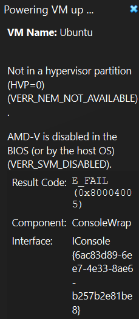
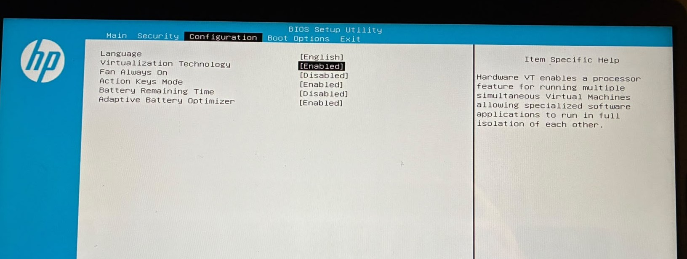

# Creating a Linux VM with Oracle VirtualBox

## Problem

I was trying to start my Ubuntu virtual machine in Oracle VirtualBox, but it failed because AMD-V was disabled.

## Root Cause

Virtualization was disabled in:

Task Manager → Performance → CPU → Virtualization

The status showed Disabled.

## Solution

1. Restart the HP 14s laptop
2. Press ESC during startup
3. Enter BIOS using F10
4. Enable virtualization
5. Save changes

 
